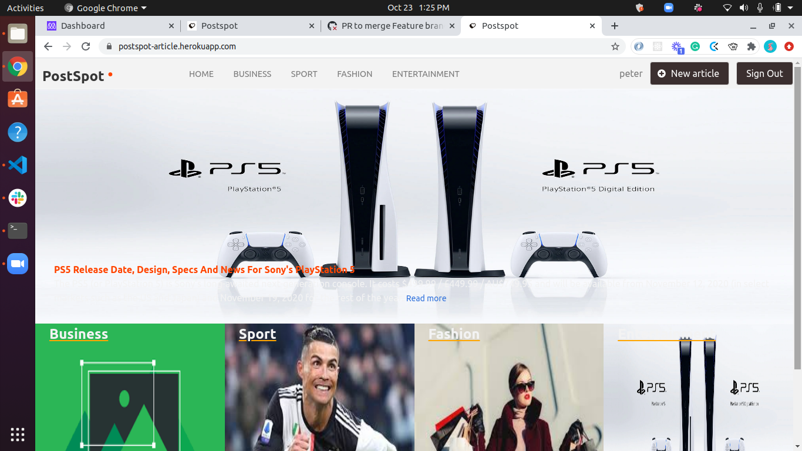

# PostSpot
It is a Lifestyle aplication, where Authors can post on several category like Bussiness, Sport, Entertainment, Fashion and so on. A user can read an article and Upvate that article. A user(reader) can view authors , see the number of article and the number of Upvote an Author has recieved. The most popular article(by highest upvote) gets an incentive of been on the front-page/banner of the application as the most popular article. Other category are showcased below as the most recent in each category.

## Screenshot :camera:


## Built With :heart:

- Ruby v2.7.0
- Ruby on Rails v5.2.4
- Postgres 12.0

## Live Demo :rocket:
 [PostSpot](https://postspot-article.herokuapp.com/)

## Work Done :computer:
- The user logs in to the app, only by typing the username and password, after sign up
- Featured article with full-width image and title in the first row. which represents an article with the biggest number of votes.
- List of all categories in order of priority. Each category is displayed as a square with its name on the top and its most recent article's title in the bottom.
- When the user clicks the category name they can see all articles in that category.
- Each page use the same top menu and footer
- When the user opens Create a new article

## Getting Started 

To get a local copy up and running follow these simple example steps.
- Fork the repository on github
- Change directory into the repository
- Install all gems
- Create Database
- Run migration


### Prerequisites

- Ruby: 2.6.3
- Rails: 5.2.3
- Postgres: >=9.5

## Setting up Postgres
Read this to set up [postgres](https://www.calhoun.io/how-to-install-postgresql-9-5-on-ubuntu-16-04/) for development
or simply start project with 
<code> rails new app_name --database=postgresql </code>

### Setup :wrench:

Instal gems with:

```
bundle install
```

Setup database with:

```
   yarn instal --chack-files
   rails db:create
   rails db:migrate
```
    Start server with:
```
    rails server
```
### Test 
 ```
    rails spec
 ```
## Set up Repo for testing
- How to setup – RSpec, Capybara, Shoulda-Matchers, Database Cleaner
- How to create a factory using Factory Girl Rails and Faker, you you can [read more](https://www.sitepoint.com/learn-the-first-best-practices-for-rails-and-rspec/) for details


### Active Storage Setup - Optional

AWS S3 buckets was used for active storage in production and development. Follow this tutorial to [learn](https://medium.com/@iachieve80/rails-6-0-upload-images-using-active-storage-and-amazon-simple-storage-service-amazon-s3-36861c03dc4a) how to set up AWS S3 for active storage.


### Github Actions

To make sure the linters' checks using Github Actions work properly, you should follow the next steps:

1. On your recently forked repo, enable the GitHub Actions in the Actions tab.
2. Create the `feature/branch` and push.
3. Start working on your milestone as usual.
4. Open a PR from the `feature/branch` when your work is done.


### Usage

Start server with:

```
    rails server
```

Open `http://localhost:3000/` in your browser.

### Run tests

```
    rpsec --format documentation
```

> Tests will be added by Microverse students. There are no tests for initial features in order to make sure that students write all tests from scratch.

### Deployment

 Heroku

## ✒️ Author

👤 **Haroon Abdulrazaq**

- Github: [@Haroonabdulrazaq](https://github.com/Haroonabdulrazaq)
- Twitter: [@Hanq_o](https://twitter.com/Hanq_o)
- Linkedin: [Haroonabdulrazaq](https://www.linkedin.com/in/haroon-abdulrazaq/)


## 🤝 Contributing

Contributions, issues and feature requests are welcome!

Feel free to check the fork this repo and create pull request if you want to make changes.

## Show your support :muscle:

Give a ⭐️ if you like this project!

## :thumbsup: Acknowledgements

- Microverse  
- ThOdinProject 

## MIT Licence :registered:

MIT License

Copyright (c) 2020 Haroon Abdulrazaq

Permission is hereby granted, free of charge, to any person obtaining a copy
of this software and associated documentation files (the "Software"), to deal
in the Software without restriction, including without limitation the rights
to use, copy, modify, merge, publish, distribute, sublicense, and/or sell
copies of the Software, and to permit persons to whom the Software is
furnished to do so.